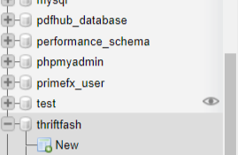
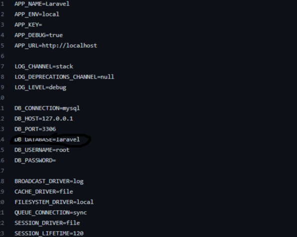
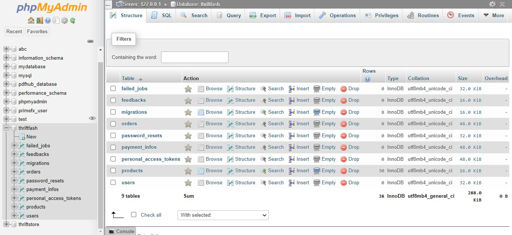

# Thrift Fashion Web Application

This is a solution to the Thrift Fashion Web Application Project from the yearly TECHWIZ GLOBAL I.T COMPETITION powered by APTECH COMPUTER EDUCATION

## API DOCUMENTATION

## Table of Contents

-   [Overview](#overview)
    -   [Project installation instructions](#project-installation-instructions)
-   [Database Design](#database-design)
    -   [Diagrams and Flowcharts](#diagrams-and-flowcharts)
    -   [Port Settings](#port-settings)
-   [API docs](#api-docs)
    -   [Getting started with the api](#getting-started-with-the-rest-api)
-   [Processes](#processes)

    -   [Built With](#built-with)
    -   [Acknowledgements](#acknowledgements)

    ## Overview

    ### Project Installation instructions.

    To use this service on your local machine, you would need to clone this repo to your local machine.

    Also, you would need to have php installed globally on your machine or you can download [XAMPP](https://www.apachefriends.org/download.html) on your machine. It comes with php inbuilt.

    ## Database Design

    For the database, we used XAMPP and PhpMyadmin to set it up. You would need to set up a database that the application will use.

    ### Example

    

    The database name here is thriftfash. You can give your database whatever name you like.

    ### Diagrams and Flowcharts

    Next you will create a .env file in the root folder of the application and set it to look like the .env.example file you will find on the folder.

    ### Port Settings

    You would then enter the new .env file you created and set your new DB_DATABASE to the name of your newly created database.

    \*\*\*Note: This project uses mysql so you can leave it at the default DB_CONNECTION value.

    

    Once all that is set up. You are ready to run the app. Open the terminal and navigate to the project folder's directory.
    After this is done enter this in your terminal:

    ```
    php artisan migrate:fresh --seed
    ```

    After the database has been seeded successfully, go to phpmyadmin panel on XAMPP and you should see a result like this:

    

## API docs

### Getting started with the REST API

### Learn the foundations for using this REST API, starting with authentication and some endpoint examples.

## Overview

## Welcome

This REST API exposes 6 public routes and 7 protected routes which will required user to be validated. When making POST request to the api, your data format should be json.

**_Note: When querying all routes, for extra precaution, PLEASE include a header.. This Header will contain simply the {Accept: 'application/json'} key/value pair.. When making get Requests, it may or not may not be necessary but it is advised it is included to avoid unnecessary errors_**

## Public Routes

## GET (localhost)/api/v1/products

This endpoint will fetch all products available in the database and return a response in json format. The response will be an array of objects representing each product in the database.

### Example Response (Good Request)

```
[
    {
        "id": 1,
        "product_name": "LightGoldenRodYellow",
        "description": "Aperiam id est est architecto nulla est. Et
        delectus at est id at et.",
        "category": "eum",
        "price": "103.68",
        "stock": 4,
        "image": "https://via.placeholder.com/200x200.png/0066ee?text=aut",
        "created_at": "2022-08-12T19:37:46.000000Z",
        "updated_at": "2022-08-12T19:37:46.000000Z"
    },
    {
        "id": 2,
        "product_name": "Gold",
        "description": "Qui ipsa omnis ipsa et et sed itaque sunt.
        Delectus ullam rerum et sunt quo mollitia.",
        "category": "repudiandae",
        "price": "69.35",
        "stock": 19,
        "image": "https://via.placeholder.com/200x200.png/009966?text
        =reiciendis",
        "created_at": "2022-08-12T19:37:47.000000Z",
        "updated_at": "2022-08-12T19:37:47.000000Z"
    },
    {
        "id": 3,
        "product_name": "AntiqueWhite",
        "description": "Ut minima eum vitae sed et cumque. Laborum
        placeat nemo distinctio nostrum pariatur et. Vel aliquid
        blanditiis labore illum sed voluptatem.",
        "category": "ut",
        "price": "94.75",
        "stock": 11,
        "image": "https://via.placeholder.com/200x200.png/00cc22?text=odio",
        "created_at": "2022-08-12T19:37:47.000000Z",
        "updated_at": "2022-08-12T19:37:47.000000Z"
    },
    {
        "id": 4,
        "product_name": "Wheat",
        "description": "Voluptas deserunt perspiciatis voluptatum
        veritatis. Sed vitae vero id est perspiciatis quia ducimus quia.",
        "category": "voluptate",
        "price": "56.89",
        "stock": 6,
        "image": "https://via.placeholder.com/200x200.png/001100?text=aut",
        "created_at": "2022-08-12T19:37:47.000000Z",
        "updated_at": "2022-08-12T19:37:47.000000Z"
    },
]
```

### Example Response (Bad Request)

If the request to this route was not successful or returned a response code above 400, it may be as a result of a server error or more likely the user may have inputted a wrong **HTTP VERB** e.g (GET, POST) etc...

## GET (localhost)/api/v1/products/{id}

When queried, this route will return a singular object containing the particular product you searched for within the database.

### Example Response (Good Request)

```
{
    "id": 1,
    "product_name": "LightGoldenRodYellow",
    "description": "Aperiam id est est architecto nulla est. Et delectus
    at est id at et.",
    "category": "eum",
    "price": "103.68",
    "stock": 4,
    "image": "https://via.placeholder.com/200x200.png/0066ee?text=aut",
    "created_at": "2022-08-12T19:37:46.000000Z",
    "updated_at": "2022-08-12T19:37:46.000000Z"
}
```

### Example Response (Bad Request)

If the api returns an error response, It is that either something went wrong on the server or more likely You did not input the proper **HTTP VERB**. Proper request configuration is advised.

## POST (localhost)/api/v1/users/register/

This endpoint will be used for registering a new User into the system. It is going to require input passed in with the request body. For this route, the required input is going to be a **'name'** field with a data type of string. An **'email'** field. A **'phone'** field which is where the phone number will be passed. A **'password'** field. An **'address'** field. And finally a **'password_confirmation'** field.

**_Note that all of these fields mentioned above will be required and if all are not provided, there will be an error response_**

### Example Response (Good Request)

```
{
    "user": {
        "name": "Dee",
        "email": "don@yahoo.com",
        "phone": "08032734613",
        "address": "1, Jazzy Lane. London",
        "updated_at": "2022-08-12T20:24:01.000000Z",
        "created_at": "2022-08-12T20:24:01.000000Z",
        "id": 1
    }
}
```

### Example Response (Bad Request)

A bad response could occur as a result of three things.

-   User already exists in the database in which case the email or phone number will cause a validation error.
    `{ "message": "The given data was invalid.", "errors": { "email": [ "The email has already been taken." ], "phone": [ "The phone has already been taken." ] } }`
-   A Server error may have occured Or,
-   A wrong http verb was used or header was missing when sending the request.

## POST (localhost)/api/v1/users/login

### Logging in a user is quite simple but it delicate because It is an important in the validation and authentication of a user.

This endpoint will require just three fields to be sent along the request. The **'email'** field, the **'password'** field and the **'password_confirmation'** field which will ofcus be the same as the password field.

### Example Response (Good Request)

On a successful query, the api will return an object with some user details and more importantly, an encrypted **TOKEN**. This token is necessary for that user to make additional requests to protected routes which we will come to in a bit.

```
{
    "user": {
        "id": 1,
        "name": "Don",
        "email": "don@yahoo.com",
        "phone": "08032734613",
        "address": "1, Jazzy Lane. London",
        "email_verified_at": null,
        "created_at": "2022-08-12T20:24:01.000000Z",
        "updated_at": "2022-08-12T20:24:01.000000Z"
    },
    "token": "1|rrz*************"
}
```

### Example Response (Bad Request)

If any of the fields inputted are wrong in some sort, there will most assurdely be an error. The error message will be as simple as pie.

```
{
    "message": "Bad Credentials"
}
```

Other errors that may occur may be cause by one or all of the errors previously mentioned in the prior examples.

## POST (localhost)/api/v1/feedbacks

This is **public** route. On this endpoint, the **'feedback'** field is the only field needed to be sent to the server. It is required to be a string.

### Example Response (Good Request)

```
{
    "message": "Feedback Created Successfully",
    "feedback": {
        "feedback": "this app is sweet",
        "updated_at": "2022-08-12T21:22:27.000000Z",
        "created_at": "2022-08-12T21:22:27.000000Z",
        "id": 2
    }
}
```

### Example Response (Bad Request)

This response will be returned if the field is left blank or without any value

```
{
    "message": "The given data was invalid.",
    "errors": {
        "feedback": [
            "The feedback field is required."
        ]
    }
}
```

## GET (localhost)/api/v1/feedbacks

This endpoint will return a response in form of an array of objects with each object representing the individual feedbacks.

### Example Response (Good Request)

This endpoint is pretty simple to use.

```
[
    {
        "id": 1,
        "feedback": "18272",
        "created_at": "2022-08-12T21:09:01.000000Z",
        "updated_at": "2022-08-12T21:09:01.000000Z"
    },
    {
        "id": 2,
        "feedback": "this app is sweet",
        "created_at": "2022-08-12T21:22:27.000000Z",
        "updated_at": "2022-08-12T21:22:27.000000Z"
    }
]
```

## Public Routes

| endpoint                           | HTTP VERB/METHOD |
| ---------------------------------- | :--------------: |
| (localhost)/api/v1/products        |       GET        |
| (localhost)/api/v1/products/{id}   |       GET        |
| (localhost)/api/v1/users/register/ |       POST       |
| (localhost)/api/v1/users/login     |       POST       |
| (localhost)/api/v1/feedbacks       |       POST       |
| (localhost)/api/v1/feedbacks       |       GET        |

## Private/Protected Routes

The routes listed from here on are all protected so user will need to have been authenticated before being able to access these endpoints. In essence, the user in context will have already been logged in to be able to use these routes. All queries will need to be sent with an Authorization header with the token as its value. Remember this **_{"Accept": 'application/json'}_**. This object(the headers object) should also include this field **_{"Authorization" : `Bearer ${token}`}_**. If you are using an http library like Axios, you can refer to [this](https://stackoverflow.com/questions/40988238/sending-the-bearer-token-with-axios) page for more info.

## POST (localhost)/api/v1/users/logout

This endpoint would be used by an already logged in user. It will enable the user to log out of the application.

### Example Response (Good Request)

A good request is ideally one that would be sent with the user's proper credentials and more importantly, with the token assigned to that user.

```
{
    "message": "Token destroyed, Logout Successful"
}
```

**_Note, once user has been successfully logged out, the token will have expired therefore, user will not be able to query the api with that token anymore._**

### Example Response (Bad Request)

A first instance of a bad request to this route would be trying to logout a user twice. This would return:

```
{
    "message": "Unauthenticated."
}
```

I'm hoping you know the reason why this happened. It's because the token used to make a request to this endpoint would have been destroyed.

## POST (localhost)/api/v1/users/payinfos

This request would be used to add payment information about the logged in user to the database.

When making a request to this route, we would need the token assigned to the logged in user to be passed along side the headers in the request body. Remember this **_{"Accept": 'application/json'}_**. This object(the headers object) should also include this field **_{"Authorization" : `Bearer ${token}`}_**. If you are using an http library like Axios, you can refer to [this](https://stackoverflow.com/questions/40988238/sending-the-bearer-token-with-axios) page for more info.

This endpoint generally requires first, the **TOKEN** and then required fields: **'id'** which is the id of the logged in user, **'card_number'**, **'expires'** and **'cvv'**.

### Example Response (Good Request)

As a side note: I could not successfully store the month/day format in the database, therefore developer will use any year and append to the month/day before submitting to the database. If this isn't done, an error will occur and the message will be that the year format is not valid -ish.

```
{
    "message": "Payment Information Submitted",
    "details": {
        "user_id": "1",
        "card_number": "2229-333-3213",
        "expiration": "2030-12-03T00:00:00.000000Z",
        "cvv": "233",
        "updated_at": "2022-08-12T22:35:10.000000Z",
        "created_at": "2022-08-12T22:35:10.000000Z",
        "id": 1
    }
}
```

### Example Response (Bad Request)

A bad request could result in a message like this. This would be when all fields are left empty. Other errors would be similar to the prior ones.

```
{
    "message": "The given data was invalid.",
    "errors": {
        "id": [
            "The id field is required."
        ],
        "card_number": [
            "The card number field is required."
        ],
        "expires": [
            "The expires field is required."
        ],
        "cvv": [
            "The cvv field is required."
        ]
    }
}
```

## POST (localhost)/api/v1/users/payinfos/{id}

This route will be used to update the payment information of a logged in user that has already submitted his/her payment information before. The id on the URI ((localhost)/api/v1/users/payinfos/{id}) will be the logged in user's id.
This endpoint generally requires first, the **TOKEN** and then required fields: **'card_number'**, **'expires'** and **'cvv'**.

### Example Response (Good Request)

A successful response would look like:

```
{
    "message": "Payment Info Updated successfully",
    "details": {
        "paymentInfo_id": 1,
        "user_id": 1,
        "card_number": "2091309230",
        "expiration_date": "2025-10-12T00:00:00.000000Z",
        "new_cvv": "290",
        "created_at": "2022-08-12T22:35:10.000000Z",
        "updated_at": "2022-08-12T23:01:04.000000Z"
    }
}
```

### Example Response (Bad Request)

The error messages where the fields are left empty are quite descriptive.
A real error that would likely come is in the case of a wrong user id. And the response would be like:

```
{
    "message": "User not found"
}
```

## POST (localhost)/api/v1/users/orders/

This route will be used to place an order for a logged in user. When making the request, the request body would require the **'id'** field which would represent the id of the logged in user, **'prod_id'** field which would be required to be an integer, **'quantity'** field which would be required to be an integer, **'bill'** field which would be in a decimal format and **'order_status'** which would be a boolean(**_Important: Do not pass in true or false in the api request instead the status code for an active would be the value of 1_**).

### Example Response (Good Request)

```
{
    "message": "Order placed successfully",
    "response": {
        "user_id": "1",
        "product_id": "1",
        "quantity": "3",
        "bill": "12",
        "isActive": "1",
        "updated_at": "2022-08-12T23:23:58.000000Z",
        "created_at": "2022-08-12T23:23:58.000000Z",
        "id": 1
    }
}
```

## DELETE (localhost)/api/v1/users/orders/{id}

This route will be used by a logged in user to cancel orders he/she may have made. This route does not require any request body to be passed. All that needs to be provided is the user's id to the api endpoint (**(localhost)/api/v1/users/orders/{"id"}**).

### Example Response (Good Request)

```
{
    "message": "Orders Cancelled Successfully",
    "payload": 2
}
```

The payload property being how many requests were cancelled on that user's name.

If user has not made any order, and by which ever means an order delete request is successfully placed, a message like this would be returned:

```
{
    "message": "No orders on this User yet",
    "payload": 0
}
```

That's all there is to this route.

## GET (localhost)/v1/users/orders/{id}

This is the last route that exposes an endpoint on the database. This route will do things. It will query the database and find all the orders pertaining to the logged in user with this {id} passed on the uri. And then it will also fetch the products information of the products the user made an order for and mesh them both in one response.

This route, unlike the prior ones, has more pizzazz to it.
This route does three things. It checks for the user with the id provided in the uri **({id})**. If there is no user with such id on the database, it will return this message:

```

```

If it finds a user, but this user has not placed any order yet, it will return a response like this:

```
{
    "message": "User hasn't placed any order yet",
    "payload": false
}
```

And finally:

If user has placed some orders, it will return a response like **this**:

```
{
    "message": "Query Successful",
    "orders": [
        {
            "order": {
                "id": 3,
                "user_id": 1,
                "product_id": 1,
                "quantity": 3,
                "bill": "12.00",
                "isActive": 1,
                "created_at": "2022-08-12T23:52:23.000000Z",
                "updated_at": "2022-08-12T23:52:23.000000Z",
                "product": {
                    "id": 1,
                    "product_name": "DarkRed",
                    "description": "Officiis explicabo nam quod commodi
                    nihil omnis. Rem qui sed recusandae aperiam ut eveniet.",
                    "category": "quam",
                    "price": "108.24",
                    "stock": 2,
                    "image": "https://via.placeholder.com/200x200.pn
                    g/0055bb?text=aut",
                    "created_at": "2022-08-12T21:55:22.000000Z",
                    "updated_at": "2022-08-12T21:55:22.000000Z"
                }
            }
        },
        {
            "order": {
                "id": 4,
                "user_id": 1,
                "product_id": 3,
                "quantity": 2,
                "bill": "65.00",
                "isActive": 1,
                "created_at": "2022-08-12T23:52:54.000000Z",
                "updated_at": "2022-08-12T23:52:54.000000Z",
                "product": {
                    "id": 3,
                    "product_name": "LightCoral",
                    "description": "Natus est nesciunt quisquam odio.
                    Totam porro nisi et non.",
                    "category": "eum",
                    "price": "7.33",
                    "stock": 5,
                    "image": "https://via.placeholder.com/200x200.pn
                    g/002222?text=enim",
                    "created_at": "2022-08-12T21:55:22.000000Z",
                    "updated_at": "2022-08-12T21:55:22.000000Z"
                }
            }
        }
    ]
}
```

### I hope the docs would go a long way in helping to query the api properly. Try it out....

## Private Routes

| endpoint                               | HTTP VERB/METHOD |
| -------------------------------------- | :--------------: |
| (localhost)/api/v1/users/logout        |       POST       |
| (localhost)/api/v1/users/payinfos      |       POST       |
| (localhost)/api/v1/users/payinfos/{id} |       POST       |
| (localhost)/api/v1/users/orders/       |       POST       |
| (localhost)/api/v1/users/orders/{id}   |      DELETE      |
| (localhost)/v1/users/orders/{id}       |       GET        |

### Port Settings

We can provide our env file configuration and port settings here.

## Source Code

Here we provide a link to our github Repo for the project OR we paste screenshots of our codebase

## Test Data Used in the Project

Open for suggestions

## Processes

### Built With

-   e.g HTML5
-   CSS

Here we list out the technologies we use in developing the project

### Project installation instructions

If any we write a paragraph and list out intructions for the project installation steps

### Acknowledgements

Here we can give a hat tip to all the participants in this project. We can list out all the people that participated in this project and eventually give props to the TECHWIZ COMP ORGANIZERs
